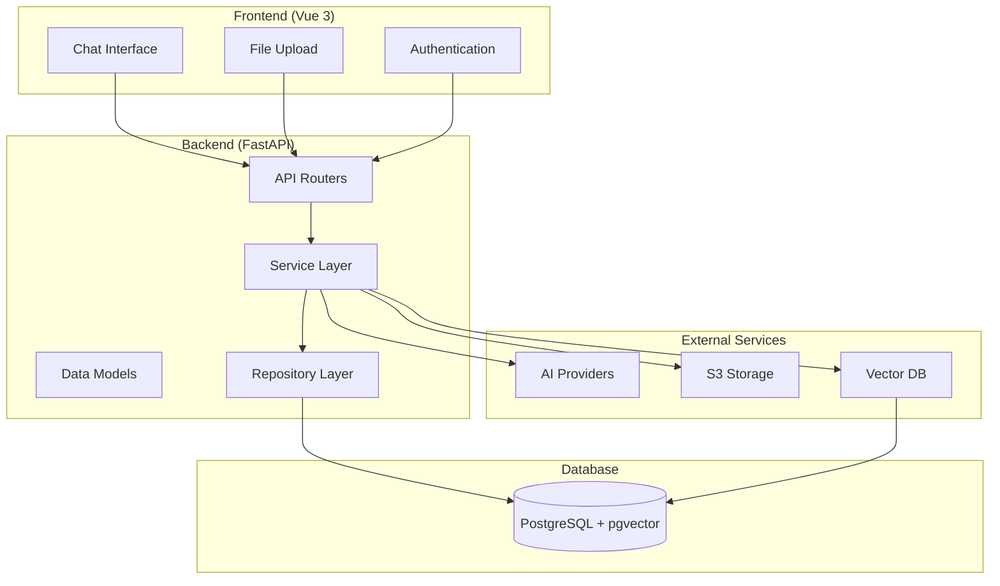
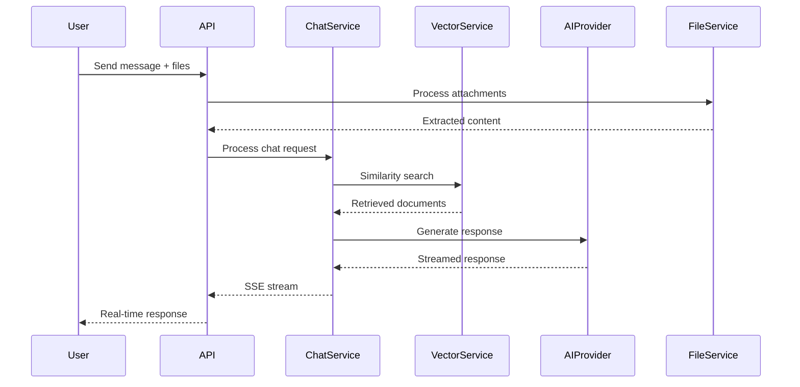
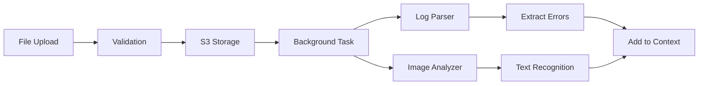

# Design Document

## Overview

This document outlines the design for a technical support system with Retrieval-Augmented Generation (RAG) capabilities. The system enables customers to describe technical issues, upload diagnostic files, and receive AI-powered solutions with real-time streaming responses. The architecture follows a modular monolith pattern with clear separation of concerns.

## Architecture

### High-Level Architecture



### Technology Stack

**Backend:**
- FastAPI (Python 3.11+) with async/await
- PostgreSQL with pgvector extension
- SQLAlchemy ORM with async support
- Pydantic for data validation
- JWT for authentication
- Server-Sent Events for streaming
- BackgroundTasks for file processing

**Frontend:**
- Vue 3 with Composition API
- TypeScript for type safety
- TanStack Query for server state
- Pinia for client state management
- shadcn/ui components with Tailwind CSS
- EventSource for SSE handling

## Components and Interfaces

### Core Service Interfaces

#### AIProvider Interface
```python
class AIProvider(ABC):
    @abstractmethod
    async def chat_completion(
        self, 
        messages: List[Dict[str, str]], 
        stream: bool = False,
        **kwargs
    ) -> Union[str, AsyncGenerator[str, None]]:
        """Generate chat completion with optional streaming"""
        pass
    
    @abstractmethod
    async def analyze_image(self, image_data: bytes, prompt: str) -> str:
        """Analyze image content for multi-modal processing"""
        pass
    
    @abstractmethod
    async def create_embeddings(self, texts: List[str]) -> List[List[float]]:
        """Create vector embeddings for text chunks"""
        pass
```

#### VectorDatabase Interface
```python
class VectorDatabase(ABC):
    @abstractmethod
    async def store_embeddings(
        self, 
        documents: List[Dict[str, Any]]
    ) -> List[str]:
        """Store document chunks with embeddings"""
        pass
    
    @abstractmethod
    async def similarity_search(
        self, 
        query_embedding: List[float], 
        limit: int = 5,
        threshold: float = 0.7
    ) -> List[Dict[str, Any]]:
        """Perform similarity search against global knowledge base"""
        pass
```

### Service Layer Architecture

#### ChatService
Orchestrates the RAG pipeline and manages conversation flow:
- Processes user messages and file attachments
- Performs similarity search against knowledge base
- Constructs context-aware prompts
- Streams AI responses with citations
- Logs pipeline steps for debugging

#### FileService
Handles multi-modal file processing:
- Manages secure file uploads to S3
- Processes log files to extract error information
- Analyzes images using multi-modal AI models
- Triggers background processing tasks
- Maintains file metadata and associations

#### VectorService
Manages knowledge base and embeddings:
- Chunks documents into optimal segments
- Creates and stores vector embeddings
- Performs similarity searches
- Manages document lifecycle
- Provides search analytics

#### AuthService
Handles authentication and authorization:
- User registration and login
- JWT token management (access/refresh)
- API key encryption and storage
- User session management
- Security middleware integration

### Data Models

#### Core Entities

```python
class User(BaseEntity):
    email: EmailStr
    password_hash: str
    encrypted_api_keys: Optional[Dict[str, str]] = None
    preferences: Dict[str, Any] = Field(default_factory=dict)

class Conversation(BaseEntity):
    user_id: UUID
    title: str
    provider: str
    metadata: Dict[str, Any] = Field(default_factory=dict)

class Message(BaseEntity):
    conversation_id: UUID
    role: str  # user, assistant, system
    content: str
    citations: List[Dict[str, Any]] = Field(default_factory=list)
    metadata: Dict[str, Any] = Field(default_factory=dict)

class Document(BaseEntity):
    filename: str
    content_type: str
    s3_key: str
    processed: bool = False
    metadata: Dict[str, Any] = Field(default_factory=dict)

class DocumentChunk(BaseEntity):
    document_id: UUID
    content: str
    chunk_index: int
    embedding: List[float]
    metadata: Dict[str, Any] = Field(default_factory=dict)

class RAGDebugLog(BaseEntity):
    conversation_id: UUID
    message_id: UUID
    user_id: UUID
    query: str
    retrieved_chunks: List[Dict[str, Any]]
    search_scores: List[float]
    prompt_template: str
    final_prompt: str
    response_metadata: Dict[str, Any]
```

### API Router Structure

```
/api/v1/
├── auth/
│   ├── POST /register
│   ├── POST /login
│   ├── POST /refresh
│   └── POST /logout
├── conversations/
│   ├── GET /
│   ├── POST /
│   ├── GET /{id}
│   ├── DELETE /{id}
│   └── GET /{id}/messages
├── chat/
│   ├── POST /message
│   └── GET /stream/{conversation_id}
├── files/
│   ├── POST /upload
│   ├── GET /{id}
│   └── DELETE /{id}
├── knowledge/
│   ├── POST /documents
│   ├── GET /documents
│   ├── DELETE /documents/{id}
│   └── POST /search
├── users/
│   ├── GET /profile
│   ├── PUT /profile
│   └── PUT /api-keys
└── debug/
    ├── GET /rag-logs/{conversation_id}
    └── GET /metrics
```

## RAG Pipeline Design

### Pipeline Flow



### Context Construction

1. **Query Processing**: Extract key terms and intent from user message
2. **File Analysis**: Process uploaded files for additional context
3. **Vector Search**: Retrieve relevant knowledge base chunks
4. **Context Ranking**: Score and rank retrieved documents
5. **Prompt Assembly**: Construct final prompt with context and citations
6. **Response Generation**: Stream AI response with source attribution

### Citation System

Citations will be embedded in responses using a structured format:
```
The error you're experiencing is related to memory allocation [1]. 
To resolve this, try increasing the heap size [2].

Sources:
[1] Memory Management Guide - Section 3.2
[2] Configuration Best Practices - Page 15
```

## File Processing Architecture

### Multi-Modal Processing Pipeline



### File Type Handlers

#### Log File Processor
- Parses common log formats (JSON, structured text)
- Extracts error codes, stack traces, timestamps
- Identifies patterns and anomalies
- Creates searchable metadata

#### Image Analyzer
- Uses multi-modal AI for screenshot analysis
- Extracts text from error dialogs
- Identifies UI elements and states
- Generates descriptive context

## Error Handling

### Error Categories

1. **Authentication Errors**: Invalid tokens, expired sessions
2. **Validation Errors**: Invalid input data, file format issues
3. **Provider Errors**: AI API failures, rate limiting
4. **Storage Errors**: S3 upload failures, database connectivity
5. **Processing Errors**: File parsing failures, embedding generation

### Error Response Format

```python
class ErrorResponse(BaseModel):
    error_code: str
    message: str
    details: Optional[Dict[str, Any]] = None
    timestamp: datetime
    request_id: str
```

### Graceful Degradation

- If vector search fails, continue with general AI knowledge
- If file processing fails, proceed with text-only context
- If streaming fails, fall back to complete response
- If primary AI provider fails, attempt fallback provider

## Testing Strategy

### Backend Testing

#### Unit Tests
- Service layer business logic
- Repository CRUD operations
- AI provider implementations
- File processing utilities
- Authentication mechanisms

#### Integration Tests
- API endpoint functionality
- Database operations with transactions
- External service integrations
- File upload and processing workflows
- RAG pipeline end-to-end

#### Performance Tests
- Vector search performance
- Concurrent streaming sessions
- File processing throughput
- Database query optimization

### Frontend Testing

#### Component Tests
- Chat interface interactions
- File upload components
- Authentication flows
- Message rendering with citations

#### E2E Tests
- Complete user workflows
- Real-time streaming behavior
- File upload and processing
- Cross-browser compatibility

## Security Considerations

### Data Protection
- API keys encrypted at rest using Fernet
- User data scoped to authenticated sessions
- File uploads validated and scanned
- Conversation history isolated per user

### Authentication Security
- JWT tokens with short expiration
- Secure refresh token rotation
- Rate limiting on authentication endpoints
- Password hashing with bcrypt

### API Security
- CORS configuration for frontend
- Request validation with Pydantic
- SQL injection prevention with ORM
- File upload size and type restrictions

## Performance Optimization

### Caching Strategy
- Vector search results caching
- Frequently accessed documents
- User session data
- AI provider response caching

### Database Optimization
- Proper indexing on search columns
- Connection pooling
- Query optimization for vector operations
- Partitioning for large datasets

### Streaming Optimization
- Efficient SSE connection management
- Token-level streaming for responsiveness
- Connection cleanup and error handling
- Concurrent session management

## Monitoring and Debugging

### RAG Pipeline Observability
- Detailed logging of each pipeline step
- Search relevance scoring
- Response quality metrics
- Performance timing data

### Debug Interface
- Internal tool for RAG inspection
- Conversation replay functionality
- Search result analysis
- Performance bottleneck identification

### Metrics Collection
- API response times
- Vector search accuracy
- File processing success rates
- User engagement analytics